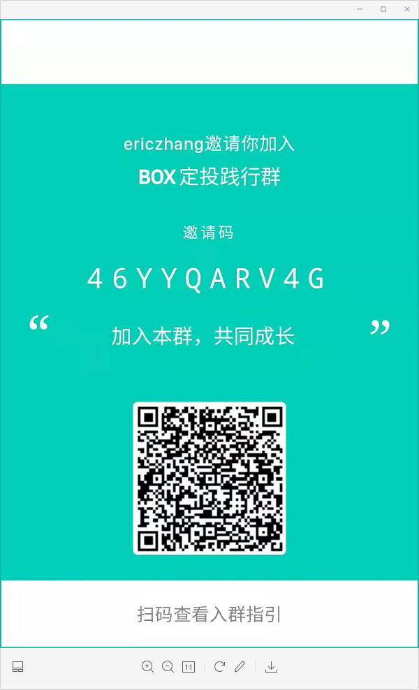
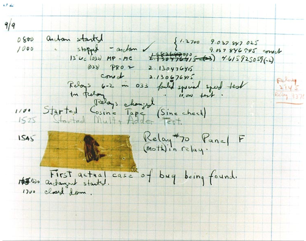

# 区块链小白书

[李笑来](http://lixiaolai.com)（著）&copy; 2019

注解：张应平

-----

## *注解 写在前面的话*

投资数字货币需要掌握两项技能——投资和区块链。

这本《区块链小白书》讲解了比特币、区块链的最小必要知识，并指出了需要避开的投资陷阱，希望所有想了解区块链行业的朋友认真、仔细阅读，在你没有看懂之前先不要急着购买任何数字货币。

如果区块链行业是未来，你什么时候进入这个行业都不晚，又或者说不管你什么时候投资数字货币都是最好的时机，前提是你真的读懂了这本《区块链小白书》。

本书是在原书的基础上做了部分修改，主要修改内容如下：

> 在原书的基础上加入了我对一些章节的理解（比如比特币其实不可能代替法币、双花（double spending）等内容），供大家更完整的理解区块链的核心概念。
>
> 为了方便清晰、准确的表述区块链，对原书目录进行了调整（比如将比特币章节中的5.区块链究竟是什么 6.区块链技术会改变世界吗？挪到了区块链章节）。
>
> 对部分内容，尤其是区块链的定义，我参考了一些业内权威文献，并基于我的思考对区块链重新进行了定义，希望大家对区块链有更全面客观的认知。

张应平，二零二一年一月写于牛市前夜 ，于古城西安

## 警告

> 区块链作为金融互联网新技术，不可避免地会涉及到投资和投机 —— 而对绝大多数普通人来说：
>
> > **投资有风险，决策需谨慎！**

## 前言

[新华社北京10月25日电](http://www.xinhuanet.com/politics/2019-10/25/c_1125153665.htm)，中共中央政治局10月24日下午就区块链技术发展现状和趋势进行第十八次集体学习。

> 中共中央总书记习近平在主持学习时强调，区块链技术的集成应用在新的技术革新和产业变革中起着重要作用。我们要把区块链作为核心技术自主创新的重要突破口，明确主攻方向，加大投入力度，着力攻克一批关键核心技术，加快推动区块链技术和产业创新发展。
>
> 习近平在主持学习时发表了讲话。他指出，区块链技术应用已延伸到数字金融、物联网、智能制造、供应链管理、数字资产交易等多个领域。目前，全球主要国家都在加快布局区块链技术发展。我国在区块链领域拥有良好基础，要加快推动区块链技术和产业创新发展，积极推进区块链和经济社会融合发展。
>
> 习近平强调，要强化基础研究，提升原始创新能力，努力让我国在区块链这个新兴领域走在理论最前沿、占据创新制高点、取得产业新优势。要推动协同攻关，加快推进核心技术突破，为区块链应用发展提供安全可控的技术支撑。要加强区块链标准化研究，提升国际话语权和规则制定权。要加快产业发展，发挥好市场优势，进一步打通创新链、应用链、价值链。要构建区块链产业生态，加快区块链和人工智能、大数据、物联网等前沿信息技术的深度融合，推动集成创新和融合应用。要加强人才队伍建设，建立完善人才培养体系，打造多种形式的高层次人才培养平台，培育一批领军人物和高水平创新团队。
>
> ……

到了 2019 年，是李笑来在区块链世界里生存的第 9 个年头。这些年来，人们对区块链的误解甚至诋毁现在终于可以烟消云散了 —— 因为区块链技术终于在中国获得了认可与支持。

然而，需要注意的是，区块链技术作为金融互联网新技术，不可避免地与投机（或投资）联系在一起，导致的结果是市场上骗局丛生，行业里鱼龙混杂，所以有必要让民众对区块链有正确且清楚的了解。这就是《区块链小白书》的意义 —— 它就是写给小白的，目的不仅是为了让小白少走弯路，更是为了让小白不要误入歧途。

李笑来，二〇一九年十月，于北京

## 准备工作

### 1. 不要滥用类比

你将要尝试着学习并理解的，是一个前所未有的重大创新，其中有很多你一下子难以理解透彻的概念，很少有人能一下子全都弄明白…… 

在这样的时候，人们会不由自主地抄近路走捷径 —— 滥用类比：

> “哦！ 我明白了，这就好像是……” 

比如，你经常会看到人们挣扎着理解了半天，突然冒出一句：“哦，我懂了，比特币就是电子黄金！” **类比**是约等号（≈），而“**这就是**”是等号（=），约等号和等号之间的差别有时甚至超过十万八千里。 比特币与电子黄金之间的关系甚至干脆就谈不上是约等于…… 全然不是一个东西。

在理解全新事物的时候，滥用类比的危害非常大，因为你压根就找不到什么过往已经存在的东西真的和这个创新竟然一模一样 —— 否则，它也不可能被称为创新了，是不是？

这种不恰当的类比被滥用多次之后，就再也没办法形成正确的理解了 —— 因为理解一个创新需要理解多个前所未有的概念，每个都做了不恰当的类比之后，多次非常不恰当的**约等于**拼接起来之后，无论如何都没办法达到一个与正确理解相近的效果。

请务必注意，每次你的脑子里不由自主地冒出 “这就好像……” 这个念头的时候，你都要把它强压回去。

### 2. 重复重复再重复

遇到暂时无法理解的概念，不要担心、不要纠结、不要停顿，你要做的事情很简单：

> * 继续读下去；
> * 读完之后再**重复读很多次**……

这是学习任何新知识或者在任何新领域探索的 “必杀技”。这背后有一个重要的原理：

> 绝大多数难以理解的知识，是因为它内部有很多 “前置引用”。

所谓的前置引用，就是一个在后面才能深入理解的概念竟然在此之前已经被引用了，导致的结果是学习者总是处于懵懂的状态。学校里的知识却不是这样的，学校里的知识总是线性层层递进的，理解了前面，就能理解后面…… 关于 “前置引用”，你可以参阅我在《[自学是门手艺](https://github.com/selfteaching/the-craft-of-selfteaching/blob/master/Part.1.F.deal-with-forward-references.ipynb)》里的阐述。

“硬着头皮读完，而后重复读很多次” 这个策略，就是可以轻松突破 “前置引用” 所设置的障碍。这个技巧，事实上可以用在任何领域。

### 3 *注解   重复是唯一正确的学习方法*

在我16年的从业经历中，大部分时间都在与密码打交道。在开始从事区块链之前，我在陕西省数字证书认证中心任副总经理，主管密码产品研发和项目实施，期间积累了大量的密码应用知识，对密码技术有一份特殊的情感。

之前很长一段时间我对于比特币认识和大部分人一样，觉着它就像QQ币一样，只是极客们的玩具。

2016年下半年，机缘巧合通过笑来老师了解到了比特币，觉着这个东西值得好好学习一下。然后我就花了很长时间学习《精通比特币》这本书，看第一遍的时候，其实我并没有看懂（后来与业内大咖聊天的时候，得知大家都有相同的经历），甚至怀疑我这么多年的技术是白搞了，后来咬着牙看了三遍，终于在某个晚上彻底看懂了比特币的实现原理。之后被比特币背后的技术所深深吸引，从此我就成为了区块链技术的重度拥护者。

区块链吸引我的原因有两个方面：一方面，区块链竟然可以将密码学应用的如此巧妙（密码学是我的老本行），另一方面，区块链竟然可以将技术与商业结合的如此完美（投资是我的爱好）。

### 4.借助群智的力量

快速掌握新知识，快速适应新领域，还有个重要的技巧，就是借助群智的力量。事实上，在学校里，你早就应该发现这个技巧了 —— 如果你能跟那些学霸经常聊天，经常玩耍，你就会发现总是在不经意之间，很多重点难点就那样轻而易举地被解决掉了……

这首先因为人是社交动物，然而更为重要的是，交流这个东西，随意的交流总是比刻意的交流更为有效 —— 因为随意的交流总是刻意解决那些连你自己都没意识到的问题…… 可偏偏，这些你自己意识不到的问题恰恰是最重要甚至最关键的问题。如果不借助这种群智的力量，很难想象还有什么办法可以解决这种隐秘的关键问题。

在 [Mixin Messenger](https://mixin.one/messenger) 上，有一个群，群号是 *7000102093*，里面有一万多人 —— 可能是目前国内最优质的小白社群。群里定期有公开课，并且定期会开放聊天机会…… 在那里，你可以向别人提问，也可以观察他人之间的讨论，很多你弄不明白的问题，可能一不小心就彻底被他人的对话解决掉了。

### 5. 注解 学区块链请联系我

截至现在，我已经写了三本区块链书籍，分别是《走进区块链》、《大话区块链》和《区块链实战教程》，除《大话区块链》由清华出版社于2019年出版之外，其他的两本都已经开源。

在中文世界里，我可能是写区块链书籍最多的作者了。能够持续写书，不是因为擅长写书，而是我确实喜欢区块链——我想让更多人了解区块链技术的真相，想让更多人参与到区块链行业里。

《走进区块链》写于2018年初，当初写书的目的只是为了梳理自己的知识体系。当书稿写完之后，闲暇之余我开始将书中内容发布在公众号以及各种内容平台上，这期间得到了很多朋友的鼓励，许多从未谋面的朋友毫不吝啬地表达了对我的感激之情，这让我对写区块链书籍建立了自信，也更坚定了写区块链书籍的决心。

《大话区块链》出版于2019年10月。由于运气比较好，正好赶上了10月24日中共中央政治局就区块链技术发展现状进行第十八次学习，所以这本书的销量还不错。

《企业级区块链实战教程》写于2020年疫情期间，由于这本书技术性比较强，所以我就直接开源在github上。

如果你想学习区块链技术和投资，可以与我联系。

> **微信ID：253841918**
>
> **Mixin ID**：928549
>
> **邀请码**：46YYQARV4G



## 比特币

比特币是个前所未有的东西，所以绝大多数人很难清楚地理解它。这一个章节之中，我们会用极为简单的语言尽量做到通俗易懂 —— 并且，尽量不涉及那些晦涩难懂的技术概念。

### 1. 问题与解决方案

人类的进步史，本质上就是 “发现问题与解决问题” 的历史。

在这个过程中，被发现的问题，有可能是 “伪问题”，所以折腾了半天，最终才发现那个 “问题” 实际上并不需要解决。比如，在哲学界，就有很多争论，有些人认为 “自由意志” 是伪问题，根本不值得讨论，与此同时，几乎同等数量的人对此持有反对意见。

问题在于，即便是 “真问题”，也有可能被识别错，进而形成 “伪问题”。中医中的 “上火” 就这样的伪问题，千百年来有无数这个伪问题的解决方案 —— 即便是到了科技发达的今天，这个伪问题的新鲜解决方案依然层出不穷。与这个 “伪问题” 相对应的**真问题**其实是 “炎症” —— 幸亏，对于任何炎症，今天的人们都有实际上已然普及的解决方案。

更令人头痛的是，竟然有些 “真问题” 实际上并不需要解决方案…… 例如，有人发现 QWERT 布局的键盘实际上并非真正有助于提高打字速度（这是个问题），于是，折腾了很久搞出 “理论上应该更有效率的” DVORWK 布局、COLEMAK 布局，以及 WORKMAN 布局—— 可最终的现实展现如何呢？然并卵，反正还是 QWERT 键盘布局使用率压倒性最高。

而针对那些应该解决的，也必须解决的真问题，在寻求解决方案的时候，还要注意另外一个问题：当前这个解决方案有没有副作用？人们在解决问题的过程中频繁遇到的是，一个问题的解决好像总是伴随着新问题的产生…… 曾经，吉林省吉林市有个松花湖里面有一种特别好吃的鱼叫松花鱼。可是，人们遇到个问题：松花鱼太好吃了，供不应求，有没有什么办法增产呢？于是，根据专家建议，人们从日本引入了一种小鱼作为松花鱼的饲料 —— 结果，不到一个季度，松花鱼绝种了！因为那些小鱼竟然会吞食松花鱼鱼籽…… 所以，今天的人们再也吃不上松花鱼了，松花鱼已经成为了传说。

回想多年前第一次阅读[比特币白皮书](http://lixiaolai.com/#/bitcoin-whitepaper-cn-en-translation/Bitcoin-Whitepaper-EN-CN.html)之时，我当然有很多折服的理由；其中之一就是能够感受到中本聪针对一个必须解决的真问题给出了一个完美且无副作用的解决方案 —— 优雅得很。

### 2. 什么是比特币

2009 年，[比特币](https://bitcoin.org)横空出世，绝大多数人对此全然不知。即便是在 10 年后的今天，比特币对大众来说也依然神秘…… 不过，总是可以用很简单的方式说清楚：

> 理解比特币最简单的方法是把它想象成一家世界银行：

> > 这家叫 Bitcoin 的世界银行发行了一个叫作 BTC 的货币……

基于翻译的局限，无论是 Bitcoin 还是 BTC，在中文之中都叫 “比特币”。

对中国民众来说，最大的狐疑来自于 “银行是谁都可以开的么？”，以及 “货币这东西你说发就发啊？”…… 刚开始的时候这确实难以理解，甚至难以接受。可科技发展已经给我们演示过很多次 “过去完全不可能的事情竟然就那么发生了！” 电子邮件就那样悄无声息地替代了书信，互联网语音通讯就那么不声不响地替代了电话。

### 3. 比特币其实不可能替代法币

对于新生事物，人们总是过于两极分化，要么断然拒绝接受，要么对它寄予过分的期待。比特币不可能替代法币（Fiat Money，法定货币）—— 只因为最简单的原因：

> 日常生活中人们需要的货币必须是价格相对稳定的。

在可预见的未来相当长一段时间里，比特币的价格不可能稳定；恰恰相反，它的价格波动剧烈 —— 仅此一点，就使得它没办法成为日常生活中人们所最普遍使用的货币。

长期来看，即便比特币的价格因为绝大多数人都接受而趋于稳定，它也只不过会成为地球上众多货币之中的一个而已，仍旧不可能替代所有法币。

### ***4. 注解 再谈比特币的货币属性***

除比特币价格波动很大之外，法币的经济调控作用也是比特币等相关数字货币无法替代的。

比如，疫情之后，因为各国有自己的货币，那么美国就可以通过货币增发刺激市场，帮助国家度过经济危机，而中国则可以采取相对保守的货币政策抑制通胀。但如果使用比特币作为法币，美国和中国就无法采用不同的货币政策解决各自国家面临的问题了。

很多人将央行即将发行的数字人民币与比特币等数字货币混为一谈，这里需要重点说明的是央行发行的数字人民币（E—RMB）又称数字货币电子支付（Digital Currency Electronic Payment，DCEP）是中国人民共和国法定货币人民币尚未正式发行的数字货币形式，但与比特币等虚拟货币有着本质的区别，后者并非国家银行发行，缺乏法偿性；而数字人民币由人民银行发行，以国家信用为担保，效力完全属于一般流通现金。

### 5. 比特币解决了什么问题

如果你有兴趣耐心反复阅读比特币白皮书，《[比特币：一种点对点的电子现金系统](https://github.com/xiaolai/bitcoin-whitepaper-chinese-translation)》，那么你就会发现一个你之前并不了解的概念是它的核心：

> 双花问题（[Double Spending](https://zh.wikipedia.org/zh-hans/%E9%9B%99%E9%87%8D%E6%94%AF%E4%BB%98)）

简单讲，就是“同一笔钱一次只能花在一个地方”，“绝对不能让同一笔钱竟然同时花到了两个地方”，否则就只能是 “记账有误”。银行的核心业务是什么呢？银行的最核心业务其实只有一个，那就是：**记账** —— 绝对不能记错账，更不应该做假账。

数字时代的尴尬在于，传统中心化管理的数据库，用来记账的时候，那账簿是有无数种可能被篡改的，账本上随意增加一条不合理的记录、随意删除一条不合规的记录，随意修改任何记录中的数字，都有可能违规且干脆无法防范……

那怎么办呢？比特币这家世界银行的解决方案很简单：

> * 我不自己管理数据库了；
> * 把这个数据库的管理权限交给所有人，大家共同维护这个账簿；
> * 每个人手中所持有的账簿必须与其他人的一样才算有效账簿；
> * 所以，全网所有的账簿都只能一样；
> * 所以，没有人可以私自篡改账簿并被所有其他人接受……

如此这般，就保证了这家世界银行的账簿不可能出错，不可能被恶意篡改，不可能再出现任何 “同一笔钱竟然同时花在两个地方” 的情况。

于是，逻辑就很清晰了：

> * **问题**是 “必须要有一个不可篡改的可信账簿……”
> * **解决方案**是 “那我们分布式管理罢！”

你看，“去中心化” 并非目标，而是分布式管理的结果；而 “公开透明” 也只是分布式管理的自然而然的结果…… 多年以来，不明就里的人们总是神话 “去中心化” 带来的颠覆，总是神话 “公开透明” 的各种优势 —— 其实是本末倒置了。去中心化指的是网络结构去中心化，不会直接带来任何颠覆。而公开透明，固然在一些地方必需必要，但，事实上绝大多数商业模式在公开透明的方式下无法良好运营。别说商业模式了，连游戏都是这样的，猜大小游戏可以一直公开透明，可棋牌游戏，必须等到游戏结束之后才可以公开透明，否则游戏就无法进行了……

### 6. *注解   双重支付*

双花这个翻译让第一次接触比特币的人会很懵，我比较习惯用双重支付（Double Spending）这个词。

双重支付说的是由于互联网信息很容易被复制，导致数字资产有可能会被重复使用，区块链使用链状数据结构加上可信时间戳可以防止双重支付。

互联网可以让信息几乎零成本的传输，比如现在知识付费时代很多的大的IP，即使一个课程的价格非常低，但是由于课程可以被十几万或者几十万用户阅读（薛兆丰的北大经济学课已经50多万用户了，199*50万，一门课程竟然可以卖到1个多亿），因此收益也会非常高。

但价值传递与信息传递却恰恰相反，我的一元钱给了你就不能给他。生活中如果我们用实物交割很容易解决双重支付的问题，比如说纸币，我将一元钱纸币给了你就不能给他，但价值一旦数字化，由于信息很容易被复制，同一笔数字资产就可能会被重复使用。

在比特币系统中，每笔交易都会加盖时间戳，所有交易都会按照时间顺序存储在链状的数据结构里，由于每笔交易都有一个唯一可信的时间戳，即使一笔交易被重复花费，但系统只认最早的那一笔交易，这样就可以有效防止一笔交易被同时花费，也就解决了价值传递的唯一性问题。

这里大家一般会产生疑问，支付宝、微信是怎样解决双重支付的问题。

本质上支付宝、微信传递的是信息，不是价值，只不过支付宝、微信有一个中心化的权威机构来解决这个问题。比如说张三通过支付宝给李四转了100元，支付宝这时候会先销毁张三的100元，然后再发行新的100元支付给李四。整个支付过程只有支付宝发行的新币有效，这样就可以有效解决双重支付的问题。

但比特币是一个去中心化的系统，没有支付宝这样的中心化机构，所以他就需要采用可信时间戳来解决双重支付的问题，而要确保加盖时间戳的记录不会出错，不可篡改（准确来说是难以篡改）就成了比特币网络的主要目标。

这个问题是比特币白皮书里重点讲述的内容，理解了双重支付，也就容易理解为什么说区块链是**价值互联网**。

### 7.  挖矿是怎么回事

比特币这家世界银行想出来的维护账簿的方式是使用分布式网络，那么就需要吸引足够多的节点来参与 —— 节点数量越多，网络越安全。可问题在于：

> 人家凭什么来参与呢？

所以，比特币这家世界银行吸引大家参与分布式网络建设的方法是：

> **每 10 分钟左右发一次 “红包”**……

这里的 “10 分钟”，是因为比特币这个分布式网络每十分钟要完成一个子账簿（就是一个区块），而后把这个新的子账簿附加到原来的总账之中（即，区块链）。生成、校验子账簿，并且确认无误地附加到原来的总账之中，这个过程需要网络中的节点贡献算力。而算力并不是白白贡献的，大家干活了之后，就可以参与 ”抢红包“！

比特币这家世界银行通过不断地 “发红包” 完成了它的货币发行 —— 按照程序最初的设定，比特币这家世界银行（Bitcoin）要持续发红包 142 年！刚开始的时候每 10 分钟左右发 50 个比特币（BTC），以后每 4 年减半一次，每个 “红包” 里的比特币数量从 50 个减成 25 个，后来再减成 12.5 个，6.25 个…… 以此类推。比特币（BTC）总量为恒定的 2,100 万个 —— 红包全部发完之后，参与网络维护的节点依然可以通过分享网络转账手续费而获益。

通过架设比特币节点获利的过程，被人们形象地称为 “挖矿”（mining），而参与建设节点的那些人被人们称为 “矿工”（miners）。因为 “抢红包” 是有一定运气因素存在的行为，所以，矿工们会集中挖矿，方式是把自己的节点算力集中到一个 “矿池”（mining pool）之中，以便增加自己抢红包时的运气。目前全球排名第一的矿池是[币印矿池](https://poolin.com)。

十年前，比特币网络刚刚运行的时候，参与人数少，总算力也很低，那时候随便用一台笔记本电脑就可以 “挖” 出很多比特币 —— 当然，那时候的比特币也不值钱…… 第一笔比特币交易是，有人用 10,000 个比特币买了 2 个披萨！


> 上图来自：https://www.blockchain.com/charts/hash-rate?timespan=all

时至今日，比特币网络算力已经大到惊人的地步，不使用专门定制的计算机（所谓 “矿机”）是很难 “挖” 出比特币的。矿机的发展，经过了 CPU 时代，GPU 时代，早就进入了 ASIC 时代，并且，从 128 纳米的芯片几经升级，目前已经有公司在研究 7 纳米、甚至 5 纳米的比特币挖矿芯片了。

### 8. 比特币凭什么涨啊涨

如果你能把比特币（BTC）理解为 “一个叫作比特币（Bitcoin）的分布式世界银行应用” 的股票，那么就比较容易理解比特币（BTC）的价格上涨趋势了。

.png)

> 上图来自 https://www.blockchain.com/charts/market-price?timespan=all

这个叫作比特币（Bitcoin）的分布式世界银行应用就好像是一家上市公司，它的核心业务只有两个部分：发行和记账。而它的价值取决于有多少人认同它、使用它 —— 在这一方面，地球上任何一家银行都如此。截至 2019 年，全球使用比特币的人数不超过 3000 万，相对于整个人口数量，这依然是个相当小的比例。所以，它还有很大的上涨空间 —— 只不过，在任何一个短期之内，上下波动都非常剧烈，所以，普通人参与投机的风险非常高。

### 9. 区块链有没有被篡改的风险

事实上，仅仅分布式管理本身，是无法做到 “无法篡改” 的 —— 顶多能做到的是 “很难篡改”。假设全网诸多节点中有 51% 的节点联合起来 —— 不管是善意还是恶意，反正都是故意 —— 那么这些节点 “合谋” 的结果就是该数据库不再是 “不可篡改” 的数据库。

以上所描述的情况，就是所谓的 “51 攻击” —— 这并不是技术能够解决的问题。区块链的第一个应用，比特币，解决这个问题的方式，同样不是靠技术，而是靠利益驱动（博弈原理）：

> 若是真的有谁能够操纵 51% 的算力，那么他会发现，对他来说，“贡献” 远比 “攻击” 更有利可图。

### 10. 小白如何购买比特币

目前世界上对小白最友好的多币种钱包是 [Mixin Messenger](https://mixin.one/messenger)，它不仅支持你所能听说过的绝大多数数字资产收发与存储，并且使用极为方便。

Mixin 下载方式：

> * iOS
>   * 国内用户，在 iTunes [下载 Mixin 畅聊版](https://apps.apple.com/cn/app/mixin-%E5%AF%86%E4%BF%A1%E7%95%85%E8%81%8A%E7%89%88/id1457938019)
>   * 国外用户，在 iTunes [下载 Mixin Messenger](https://apps.apple.com/app/mixin/id1322324266)
> * Android
>   * 国内用户，在[腾讯应用宝下载](https://a.app.qq.com/o/simple.jsp?pkgname=one.mixin.messenger)，或者[小米应用商店下载](http://app.mi.com/details?id=one.mixin.messenger)
>   * 国外用户，在 [Google Play Store 下载](https://play.google.com/store/apps/details?id=one.mixin.messenger)

iOS 国内用户下载的 [Mixin 畅聊版](https://apps.apple.com/cn/app/mixin-%E5%AF%86%E4%BF%A1%E7%95%85%E8%81%8A%E7%89%88/id1457938019) 需要添加小钱包机器人（ID: *7000101425*）才能使用数字资产收发存储功能。


在 Mixin 里提供 OTC 服务的是 exin，机器人 ID：7000101276。

你也可以到 [https://big.one](https://big.one) 或者 [https://b1.run](https://b1.run)，这是国内老牌交易所云币团队打造的有信誉保障的区块链数字资产交易所，可以使用 USDT 购买比特币，它也有 [OTC 服务](https://otc.b1.run/trade)。另外，Big.One 的 Mixin 大群 ID 是：*7000101910*。

再次需要提醒风险：

> 区块链数字资产价格波动巨大，**投资有风险，决策需谨慎！**

另外，对小白来说最靠谱的投资策略是**定投策略** —— 至于具体应该如何操作，请移步[《定投改变命运》（开源第三版）](https://onregularinvesting.com)。

### 11. 如何免费投资比特币

2020 年 6 月，我投资了 “水龙头APP”。 —— **因为我自己天天用，所以，只能投资了**…… 正如我十年前买苹果股票一样，天天用的东西，竟然能投资的话，那么最好投资它。

“水龙头” 的工作原理很简单：

> 通过它在各大电商平台上（淘宝、天猫、京东、拼多多）购物的时候，它会在月底帮你把返利攒起来换成 **比特币** 交给你……

这个简单的工作原理决定了很多重要的特性：

> * 绝对零风险
> * 甚至零投入
> * 符合 “蛋壳投资原则”……

第一条，对李笑来来说是至关重要的，因为我的身份敏感，所以，但凡有一点点风险，我也不会直接推荐。对用户来说，必须是真正的**零风险**，才是李笑来可以认真推荐的产品。

第二条，是真正意义上的 **“普惠”**，99% 以上的人不参与投资的本质理由都一样：“没啥钱可用来投资” —— 可现在，竟然可以零成本参与投资，这难道不是很神奇吗？

而最后的第三条，**“蛋壳投资原则”**，也非常非常重要，其原因请参阅我认真创作的[《定投改变命运》（第三版）](https://ri.firesbox.com/#/cn/)中的内容：

> https://ri.firesbox.com/#/cn/

万一（我是说，万一，而不是一定）将来比特币再涨个几倍几十倍，那今天看起来 “少得可怜” 的 3～5% 的返利，可能会让你今天的消费成本削减为零……

我自己用了一段时间，觉得还是挺可怕的 —— 每个月网购金额差不多三五万的李笑来，能 **“凭空” 多出** 价值一千多元人民币的比特币……

所以，现在我买任何东西的时候，都会多花几秒钟，从水龙头的 “超级搜索” 开始…… 这几秒钟绝对值当啊！

比如，今天我的一位微信好友（胡子晗）教我弹吉他的时候，提起有一种可以让指甲更硬一点的指甲油，日本产品，牌子是 Kaina…… 我还真是第一次知道还有这种东西！我的指甲太薄，这些年从来没有留起来过，所以尽量只用拨片…… 现在，我倒是想象听听留起指甲后的音色了！

于是，我打开水龙头 APP，在淘宝找到这个商品，下单购买，然后，账户里多了价值几块钱人民币的比特币……


使用步骤很简单：

> 1. 识别第一张海报中的二维码，下载 **水龙头 APP**，我的邀请码是：`XHCXRE`
> 2. 打开水龙头APP
> 3. 搜索商品 —— 这个 “超级搜索” 能在淘宝、天猫、京东、拼多多上搜索商品…… 比如，我就要搜索 **Kaina** —— 这个朋友刚刚介绍给我的品牌；
> 4. 水龙头帮我在淘宝上找到了这个商品…… 有的时候，有多个平台可选，自己衡量一下吧，售价、收货时间等等。然后，在此之前，你的手机里必须已经安装了这些购物平台的 APP 才可以跳转到它们上面购买……
> 5. 购买的同时获得免费比特币
> 6. 跳转到购物平台购买……

如此这般，你在保持正常日常消费的同时，也免费投资了比特币 —— 最好长期持有，以观后效！

### 12. 山寨币

2009 年至 2017 年之间，至少有几千个山寨币出现，而后批量死亡。所谓山寨币，就是对比特币进行了事实上并没有什么用的改造，然后取一个什么名字，然后就发布的所谓下一个比特币，下一个机会……

有一个山寨币，对比特币进行了最没用的改造 —— 只是把确认时间从 10 分钟改成了 2.5 分钟 —— 却最终顽强地活了下来…… 它叫莱特币（Litecoin）。也许是它的宣传语太吸引人了吧，它说，比特币是金，我们莱特币是银。于是，大量觉得自己错过了比特币的人，购买了莱特币…… 你看这世界多有趣，它总是有一定的容错机制。

## 区块链

自从比特币横空出世之后，支撑比特币的底层技术，即区块链技术引起了巨大的关注。人们开始琢磨：“这个区块链技术还可以用在什么地方呢？”  —— 当然，人们琢磨得最多的还有另外一个问题：“我应该如何获利呢？”

### 1. 公链

2015 年年底，[以太坊](https://www.ethereum.org/zh/)开始融资；2016 年，云币成了地球上第一个上架交易以太坊的交易所…… 2017 年，以太坊成了最火爆的区块链项目。

以太坊想要解决的问题是什么？又，解决的足够好吗？

历史证明，以太坊是一次并不成功的尝试 —— 它想要成为一个区块链技术应用平台，在这个分布式的 “计算机” 上，有它自己的编程语言；用这个特定的编程语言写的程序被称为 “智能合约”；人们可以在以太坊这个平台上发布各种基于区块链技术的应用…… 也就是说，它想要成为一条公链（Public Chain），顾名思义，就是公众都可以使用的区块链。

以太坊所遇到的困难，其实是它尚未诞生之时已经被质疑的东西：使用 [PoW](https://en.wikipedia.org/wiki/Proof_of_work) 共识机制的一条 “公链” 就是难以承载真正有意义的大规模应用。即便是以太坊的 PoW 被设计成十几秒之内确认一次，不要高兴得太早，10 分钟和 10 几秒事实上没什么区别 —— 因为真正有意义的大规模应用需要的是每秒钟成千上万次确认才可以……

缺陷最大的是以太坊独立设计的编程语言 Solidity，虽然最初的时候最大的宣传点是它 “图灵完整”，可事实上，并没有什么用，为什么呢？因为不管谁写的编程语言都一样，都难免有臭虫（bug）…… 可问题是，这种编程语言是用来写所谓 “智能合约” 的，这种程序是直接涉及到钱的，于是，只要有问题就会被攻击。以太坊上线没多久，有个叫作 DAO 的项目就被黑客攻击转移走了大量的资产，以太坊只好以 “紧急分叉” 来 “解决” 问题，于是遗留了一个今天人们不知道那是用来干什么的 ETC（Ethereum Classic），新的币叫作 ETH。

虽然以太坊计划将共识机制从 PoW 更新为 dPoS，但它现在面临两个问题：1. 如此这般的话，那么只能再次分叉，新的币叫什么好呢？老的币又能干什么呢？对技术人员来说是困扰，对投资者来说是未知的风险；2. 基于 dPoS 机制的，有多线程支持的分布式计算平台 [EOS](https://eos.io) 早已于 2018 年 6 月正式上线……

### 2. 共识机制

首先，在这里请注意，我们所讨论 “共识” 是网络中节点之间的共识，是机器与机器之间的共识，而不是人与人之间的共识。人与人之间的共识与区块链没有任何关系 —— “共识” 这个词常常被人们误用、滥用。这也是为什么我曾经戏谑地说 “傻屄的共识也是共识” 的原因。我想说的是，傻屄们死活搞不懂，那不是人与人之间的共识，然后吧，他们还总是不懂装懂……

区块链本质上来看就是一个分布式管理的可不断添加记录却不能删除记录的数据库。由于是分布式维护，所以，每次添加记录的时候，要在网络节点之间达成共识，确认要被添加的记录有效之后才能进行添加操作。

比特币所采用的共识算法是 PoW（Proof of Work，工作量证明机制），简单讲，就是网络中的节点根据自己的贡献获得权益，多劳多得。PoW 在比特币这个区块链技术的第一个应用之中是完美无缺的，可是，正如你所看到的，对野心在于 “创建一个分布式计算机” 的以太坊来说，PoW 就成了致命缺陷 —— 无论如何，这种机制的新记录确认速度就是满足不了现实需求。

dPoS（[Delegated Proof of Stake](https://en.wikipedia.org/wiki/Proof_of_stake#Delegated_Proof-of-Stake)）是 PoS（[Proof of Stake](https://en.wikipedia.org/wiki/Proof_of_stake)）的进一步改良。简单讲，就是你作为持币者，可以通过持有量和持有时间的多少获得权益。PoS 的问题在于，大多数持币者并没有专业知识，也不见得有足够的预算，于是，他们不见得能提供高性能节点所需要的计算机硬件和软件要求。于是，进一步改良的 dPoS 采用了基于投票选举的共识算法，持币者选出若干个节点来运营网络…… 

小白对更多的技术细节可以直接跳过，需要弄明白的是，PoW 无法支撑公链的需求；而 dPoS 是 EOS 创始人 Dan Larimer 的创新概念，PoS 从 2014 年的 [BitShares](https://bitshares.org/) 时代就开始验证，后来经过若干次更新改进，变成了 dPoS。你可以将 dPoS 理解为一次为了平台性能相对于 PoW 而作出的妥协，而这个共识算法目前来看是公链的最靠谱选择之一。

### 3. 山寨链

正如曾经山寨币群魔乱舞一样，2017 年开始，各种山寨链神出鬼没。各种名称的共识机制漫天飞舞，Po 两个字母之后，从 A 到 Z，全被用光了，各种 PoX（Proof of something）…… 它们真的有存在的必要吗？这些山寨链欺负普通民众不懂编程，大面积抄袭，反正抄袭已经没戏了的以太坊不划算，于是只能抄袭已经证明为较为靠谱的 EOS。事实上，除了这两个项目之外，抄袭者们也没有什么其他的选择。正如当年山寨币除了抄袭比特币之外也没有任何其它选择一样。

这世界是有容错机制的，山寨比特币的莱特币顽强存活到了今天；也许，那些抄袭 EOS 的各种项目之中，也会有那么一两个最终幸存？到底哪一个能够最终幸存我们没办法提前知道，但，我们知道的是，抄袭不可能超越。所以，山寨项目是留给那些想不明白的人的，不是吗？

### 4. 目的与手段

正如你所见，打造一个不可篡改的分布式数据库，是**目的**；而区块链技术，是达成这个目的的**手段**。再进一步，所谓共识机制，是区块链技术的一部分；除了共识机制之外，还有另外一个重要的组成部分，奖励机制 —— 否则人们不会自动对网络有所贡献。

长期以来，所谓的技术创新基本上都聚焦在了如何改进共识机制之上，而奖励机制被默认为 “不可或缺” 的组成部分。人们以为，共识机制和奖励机制就好像是区块链这架马车的两个轮子一样，缺一不可。

有没有可能去掉奖励机制呢？然而，在此之前，还要问另外一个问题：为什么要想办法去掉奖励机制呢？

我们之前提到过，乍看起来区块链技术应该被应用到很多地方：

> 在一些场景下，这个世界的确需要不可篡改的数据库技术。比如，法院的卷宗，交通部门的违章记录，工商部门的企业登记，民政局的婚姻登记，公安局的身份证，大学的毕业证，等等等等……

你看，几乎所有的政务部门都需要不可篡改的数据库技术，可是，你不能让这些部门为了使用区块链技术而天天 “挖矿” 吧？关键矛盾在于，公共事务领域反正不是也不应该是靠利益刺激运行的。

看来，在一些场景下，有必要去掉奖励机制 —— 可如何做到呢？冯晓东设计的 Mixin Network 提供了一个解决方案 —— 它的非商业非营利版叫作**恒信网络**（HengXin Network）。

恒信网络是世界上第一个已被证明为可行的**无币区块链解决方案**。

恒信网络通过使用 TEE（Trusted Execution Environment，可信执行环境）生成了一个由中心化管理渐进为去中心化管理的可以无需奖励机制的分布式网络。除了 TEE 之外，恒信还结合了 DAG（Directed Acyclic Graph，有向无环图）为基础，辅以 ABFT（Asynchronous Byzantine Fault Tolerance，异步拜占庭容错）算法作为解决方案，构造了一个成本低廉，易维护、易使用，性能高，兼容性强的不可篡改的分布式网络。

TEE（[Trusted Execution Environment](https://en.wikipedia.org/wiki/Trusted_execution_environment)，可信执行环境）的作用是，向公众证明网络中某个节点（或称服务器） “正在运行的代码” 的确是 “它声称正在运行的代码”。简单来说，你可以把具备可信执行环境的服务器理解为一个透明盒子，外部可以 “看到” 它内部正在运行的代码 —— 换言之，没有任何人能够在不被察觉的情况下改变这个透明盒子里正在运行的代码。

网络设计者可以自己在网络上部署一定数量的“透明盒子”，如此这般构成一个 “类自治” 的分布式网络 —— 这个时候，这个网络虽然已然是分布式网络，但依然是中心化治理的，因为那些透明盒子是网络设计者自己部署的。

然而，这时这个网络已经具备一定的 “自治” 特征，因为每个节点都是透明的，所以，即便是网络设计者本身也无法做到在他人不知情的情况下修改节点中正在运行的程序……

再进一步，这个网络是开放的，任何人都可以使用具备可信执行环境的服务器加入网络充当节点 —— 这里的关键在于，加入者是因为需要这个网络、需要这个网络所提供的服务才加入的，而不是因为网络设计者对加入者有所激励 —— 需要注意的是，恒信网络没有奖励机制。

加入者越多，网络越健壮，安全性也会因此越来越高。当网络的节点达到一定数量之后，网络设计者可以撤掉自己当初部署的节点，把整个分布式网络全部交由自由加入的节点管理…… 至此，一个自治的、非中心化管理的分布式网络终于形成。

恒信网络的商业版，Mixin Network 于 2019 年 2 月主网正式上线，迄今为止（2019 年 11 月）性能稳定；已无故障运行 9 个月。

#### a. 支持大规模高并发

与传统区块链不同，恒信网络使用的是  DAG（[Directed Acyclic Graph](https://en.wikipedia.org/wiki/Directed_acyclic_graph)，有向无环图）技术；它没有传统的区块概念，它以每一笔交易为单位，尽可能快的向整个网络进行指数级广播，与此同时，避免双花的是ABFT（Asynchronous [Byzantine Fault](https://en.wikipedia.org/wiki/Byzantine_fault) Tolerance，异步拜占庭容错）算法。于是，在恒信网络中，每条交易记录的确认，不再有时间瓶颈，TPS（Transaction Per Second）在恒信网络中是一个完全没有必要存在的概念 —— 恒信网络几乎和中心化服务器一样高效。

#### b. 兼容各种其它公链

由于恒信网络的核心只做记账，所以，理论上它能支持所有公链的资产管理。目前已支持的公链包括比特币、以太坊、EOS、Ripple 等 50 余条公链（数量一直在不断增加）。通过结合使用多重签名算法与异步拜占庭容错算法，用户的公钥与私钥管理被封装了起来，恒信网络的用户只需要通过最多试错 5 次的 6 位数字密码统一管理任何公链上的数字资产 —— 极大地降低了用户使用成本，同时也极大地提高了数字资产的易用性。

#### c. 关于所谓智能合约

与以太坊和 EOS 不同，恒信网络只做资产管理网络。至于所谓的 “智能合约”，在恒信网络中的解决方案是用户使用任何编程语言编写他们的程序，而后将这些程序开源，并运行在具备可信执行环境（具体来说，就是 Intel SGX）的服务器上，公开透明地运行这些程序。这么做的好处是，智能合约与恒信网络本身无关，恒信网络却能提供智能合约（其实就是各种程序）的完全透明运行环境。

### 5. 区块链究竟是什么

区块链是 blockchain 这个英文新词汇的 “生硬翻译” —— 事实上，绝大多数翻译就是很生硬的，你看看上面的 “双花”（Double-spending）就能感觉到了。

所谓**区块**，是 *block* 的翻译，可以理解为 “信息块”（这个单词在计算机领域就是这个意思）。

> **block**, *Computing*: a large piece of text processed as a unit.

如此这般，**区块链**（blockchain）就是字面上的意思，它就是由前后链接起来的信息块构成。

在比特币这家世界银行的设计中，区块（block），就是一个又一个不断生成的**子账簿**，这些子账簿通过一种特定的算法（哈希算法）前后链接起来，形成**总账簿**（blockchain）。从这个角度望过去，**区块链技术没什么神秘的，通俗地讲，它只不过是一种新的记账技术而已**。

比特币这家世界银行，就是这样建立在区块链技术上的第一个分布式应用。而区块链技术，通俗地讲，无非是个不可篡改的分布式数据库技术而已。

### 6. 分布式账簿技术

**准确地讲，区块链技术，应该特指的是比特币的 “分布式账簿解决方案” 中所使用的技术。**分布式账簿的解决方案之中，比特币的区块链技术理论上应该是其中的一支 —— 目前已有很多其它的可行解决方案，比如上文中提到的基于 dPoS 的 EOS 和基于 DAG + TEE 的 Mixin Network。

我们可以从另外一个角度观察比特币的区块链技术：

> * 问题：分布式网络很脆弱，它总是面临一个问题，被称为[拜占庭将军问题](https://zh.wikipedia.org/wiki/%E6%8B%9C%E5%8D%A0%E5%BA%AD%E5%B0%86%E5%86%9B%E9%97%AE%E9%A2%98)
>
> * 解决方案：比特币的解决方案（区块链技术）的巧妙之处在于，它并没有解决拜占庭将军问题，而是 “**绕过**” 了拜占庭将军问题：
>
>   * 网络中的所有节点都参与 “猜谜”（即，所谓的挖矿）
>   * 每次猜谜都需要大约 10 分钟左右才可以完成（以此降低分布式网络中各个节点之间的通讯频率）
>   * 谁最先完成谜题得到正解，谁就充当一次分布式网络的中心 —— 这个节点会获得奖励，这个节点会把含有获得奖励的交易记录的区块打上自己的签名广播出去…… 下一次通讯的时候，这个分布式网络还是有中心的，只不过，每一次的中心都各不相同……
>
>   于是，从这个角度望过去，比特币（区块链）的解决方案非常讨巧：
>
>   > 想办法让一个分布式网络像一个中心化网络一样工作……

也就是说，区块链技术的重点之一就是 “通过降低分布式网络中的节点之间的通讯频率” 去保证每次都有一个节点 “最先完成谜题”，进而让这个节点充当一次分布式网络的 “中心”…… 偶尔会出现有若干个节点同时算出谜题怎么办？还有进一步的技术解决方案，“选择最长链”（哈哈，超纲了，过于技术的细节不在本文讨论范围之内）……

于是，我们可能会得出一个与绝大多数人不一样的结论：

> 区块链技术，本质上（也已然被证明为）只适合比特币……

所以，未来真正改变世界的，并不是狭义的区块链技术，而是分布式账簿技术（Distributed Ledge Technology）—— 只不过，现在的绝大多数人误以为区块链技术就是分布式账簿技术本身或者全部，殊不知，**区块链技术只是分布式账簿技术的一个分支而已**。

### 7.  注解 当我们谈区块链时我们在谈什么

中文世界里有很多词汇由于历史原因出现了一些争议，比如“熊猫”这个词语的形成就有很多种说法。

下面这个说法是一种广为流传的版本。

>“40年代，重庆举办了一次动物标本展览。当时展品标牌上分别用中、英文书写着猫熊的学名，但由于那时的中文习惯读法是从右至左，故而国人都把按英文书写方式书写的猫熊，读成了熊猫，并延用至今，唯台湾现仍称其为猫熊。

还有很多种说法，大家可以参见维基百科中[大熊猫](https://zh.wikipedia.org/wiki/%E5%A4%A7%E7%86%8A%E7%8C%AB)的介绍。

中文世界里引进了大量的英文词汇，由于这些词汇中文世界里没有相应的词语，翻译的时候就会出现各种不同的版本。比如计算机里常用的词语“bug”，中文很多书籍都翻译成“臭虫”，也有翻译成“程序错误”的。按照bug这个词的起源来讲翻译成“臭虫”更接近原本的意思，但经常会让人士丈二和尚摸不着头脑。

>在1947年9月9日，葛丽丝·霍普（Grace Hopper）发现了第一个电脑上的bug。当在Mark II计算机上工作时，整个团队都搞不清楚为什么电脑不能正常运作了。经过大家的深度挖掘，发现原来是一只飞蛾意外飞入了一台电脑内部而引起的故障（如下图所示）。这个团队把错误解除了，并在日志本中记录下了这一事件。也因此，人们逐渐开始用“Bug”（原意为“虫子”）来称呼计算机中的隐错。现在在华盛顿的美国国家历史博物馆中还可以看到这个遗稿。



区块链同样也是一个外来词。

区块链这个词是由元道（中国规模最大电信中立 IDC 运营商世纪互联数据中心创始人、董事长陈升）于2014年提出的。从字面上理解，区块链就是区块连接成的链，英文是BlockChain，Block就是区块的意思，Chain是链的意思，合起来就是连接在一起的区块。比特币白皮书里，区块和链是两个独立的单词，直到2015年以太坊出现后区块链这个词才流行起来。

>本解决方案起步于一种时间戳服务器。时间戳服务器是这样工作的：为一组（block）记录的哈希打上时间戳，而后把哈希广播出去，就好像一份报纸所做的那样，或者像是在新闻组（Usenet）里的一个帖子那样。显然，时间戳能够证明一个数据在某个时间点之前已然存在，否则该数据哈希也就无法生成。每个时间戳在其哈希中包含着之前的时间戳，因此构成了一个链（chain），每一个新的时间戳被添加到之前的时间戳之后。

这里我不对区块链这个词发表任何看法（[央视对话栏目](https://v.qq.com/x/cover/tn1n8d13fwavl8g/z0026r8fpc8.html)专门做了一期区块链节目，各位大佬纷纷表达了自己的观点），重点探讨一下区块链这个词的真实含义。


对于区块链业内有两种比较权威的解释，一种是狭义的区块链，另外一种是广义上的区块链。

狭义的区块链特指比特币时代的区块链。比特币的使用的区块链技术由于采用了工作量证明机制，每十分钟确认一次，目前只能用于数字货币。基于比特币技术的以太坊目前也只能用于发币。

广义的区块链指的是一种分布式账本技术，一种信任的基础设施，也就是国家现在提倡的区块链，业内也称为联盟链（笑来老师称为无币区块链）。

美国国家标准与技术协会2018年10月发布的[区块链白皮书]([https://nvlpubs.nist.gov/nistpubs/ir/2018/NIST.IR.8202.pdf](http://www.javashuo.com/link?url=https://nvlpubs.nist.gov/nistpubs/ir/2018/NIST.IR.8202.pdf))中对区块链的定义如下：

>区块链是防篡改的、没有中央权威的、去中心化的数字分类账本。

国家可信区块链2019年10月发布的[《区块链白皮书》](http://www.caict.ac.cn/kxyj/qwfb/bps/201911/P020191108365460712077.pdf)对区块链的定义如下：

>区块链（Blockchain）是一种由多方共同维护，使用密码学保证传输和访问安全，能够实现数据一致存储、难以篡改、防止抵赖的记账技术，也称为分布式账本技术（Distributed Ledger Technology）。典型的区块链以块-链结构存储数据。

维基百科中对区块链的定义如下：

>区块链是借由密码学串接并保护内容的串连文字记录（又称区块）。
>
>每一个区块包含了前一个区块的[加密散列](https://zh.wikipedia.org/wiki/密碼雜湊函數)、相应时间戳记以及交易资料（通常用[默克尔树](https://zh.wikipedia.org/wiki/哈希树)(Merkle tree)算法计算的散列值表示），这样的设计使得区块内容具有难以篡改的特性。用区块链技术所串接的分布式账本能让两方有效纪录交易，且可永久查验此交易。

在[《大话区块链》](https://item.jd.com/12719282.html)里从技术角度给出一个我认为更为清晰的解释：

>区块链是一种分布式账本技术（DLT，Distributed Ledger Technology），通过共识机制发动节点来共同记账。为防止共识信息被篡改，通常情况下，区块链会采用链状数据结构，使用密码学技术进行数据存储。

这里首先我肯定了区块链是一种分布式账本技术，然后又指出通常情况下区块链会采用链状数据结构，隐含的意思就是也可以采用其他数据结构，比如有向无环图（DAG），书中我也举了IPFS的例子进行了详细的说明。

当然我的理解也只是一家之言，但必须说明的是不管你理解的区块链是什么，你需要明白大家说区块链的时候他们到底在说什么？！

### 8. 区块链技术会改变世界吗

在一些场景下，这个世界的确需要不可篡改的数据库技术。比如，法院的卷宗，交通部门的违章记录，工商部门的企业登记，民政局的婚姻登记，公安局的身份证，大学的毕业证，等等等等……

尤其需要区块链技术的领域，除了**公共事务领域**之外，还有**物联网**。机器产生数据的速度和数量都远远超过人类，而机器数量未来也会必然远远超出人口的数量不止几个量级…… 面对未来不可想象地庞大的物联网世界，不可篡改的数据记录绝对不可或缺 —— 甚至可以说，没有区块链技术，未来的物联网世界不可能安全发展。

所以说，区块链技术的确会改变世界。

不过，至于区块链技术究竟在将来会把这个世界变成什么样子，今天的我们很难准确预测。历史证明，每次技术革新出现的时候，我们的想象力都极为匮乏，我们的预测能力都聊胜于无。三四十年前，人们想象互联网是这样改变世界的：

> 到时候你给别人写信，就会变成这样：你在这边敲完，那边的打印机就自动把整个信件打印出来了……

事实上，没有任何一个专家能在四十年前想象出我们今天可以拿着一个掌中设备坐在家里点两下一会儿外卖就送到门口了…… 所以，**过多的预测和想象**，实际上是徒劳无益的。

### 9. 注解 区块链的应用原则

一项新技术的出现，一般会有两种截然不同态度的人，一种是对新技术盲目乐观，认为一项技术可以改变世界；另一种人则过度悲观，认为这些技术只不过是新瓶装旧酒，没啥实际价值。

盲目乐观的人要么别有用心（就是我们常说的割韭菜），要么就是无法判断技术的时点（无法正确区分新技术当下和未来对生活的影响）。过度悲观的人实际上内心深处对新技术带有偏见。

区块链非常类似于中心化世界的云计算，一开始很多人对云计算的看法就是云里雾里，认为云计算只不过是虚拟化换了个名字而已。

2019之前大家对区块链认识和云计算非常类似，认为区块链其实就是分布式，其实区块链不只是分布式，它还包含了密码学、P2P、博弈论等技术思想，目标是打造一个不可篡改的数据库。

盲目乐观和过度悲观都不可取，对新技术我们应该保持**谨慎乐观**。但真的要做到谨慎乐观确是非常难的，一方面要看懂新技术当前可以发挥的作用，另一方面则要看到这项技术未来的发展趋势，将短期目标和长期目标结合起来，才能享受到新技术带给我们的红利。

从2016年到现在，在区块链这条路上我也经历过盲目乐观，也有极度沮丧的时候，在不断思考和实践的过程中，总结了区块链的应用原则，分别是数据即效益、以信任为生以及分布式自治，希望通过应用原则能够让大家看清区块链现在以及未来的发展趋势，以一种谨慎乐观的态度参与到区块链行业来。

**数据即效益指的是对于一些重要的数据，区块链可以在保证数据所有权的情况下实现数据共享。** 

存证、数字版权和数据共享是区块链现阶段可以落地的应用场景，数据资产化将会是区块链技术未来一个大的发展趋势。

**以信任为生指的是区块链的本质是信任，可以实现跨机构、跨组织、跨部门协作。**

金融机构做的就是信任中介的生意，金融行业是最早研究区块链的机构。虽然金融行业业务创新层出不穷，但实际情况金融服务能力并不能满足社会发展需要，尤其在中小企业贷款方面金融服务能力明显不足，所以金融科技Fintech成为这几年最热的一个话题。相比其他技术，区块链与金融有更强匹配性。除了金融，比如供应链管理、智能制造、医疗、商品溯源、精准扶贫这些领域的痛点就是跨机构协作。

**分布式自治指的是业务本身具有自组织去中心化的特点，区块链技术的出现使得自组织的业务有可能成为未来社会的主流。**

互联网和企业信息化近10年的快速发展，得益于云计算这种中心化技术的成熟，但中心化架构除了自身的缺陷之外，在面对一些新业务明显能力不足。当中心化业务走到尽头，许多分布式自治的新兴业务在不远的将来将会成为社会的主流。不管是数据共享，还是信任重构都是使用区块链解决现有业务痛点，属于降维打击——是使用区块链技术解决传统业务的痛点。但类似物联网、分布式能源等业务都属于新兴业务，传统中心化架构根本无法应对，如何将区块链技术应用在这些业务场景中是区块链技术未来的发展趋势，但受制于业务和技术的不成熟这些领域的到来还需时间。

## 避开投资陷阱

对小白来说，有个问题非常现实：小白是没有技术能力的 —— 于是，小白们最终只关心一个问题：我如何获利？可问题在于，投资这东西，对小白来说更为险恶……

### 1. 钱包安全

数字资产的钱包，每条公链都不一样，直接导致的结果就是小白们压根弄不明白到底应该用哪个，怎么用？所以，根据过往历史数据来看，绝大多数小白会直接把交易所当作钱包使用。小白们把钱充进交易所，而后买到各种他们想要买的币，而后就存在交易所 —— 因为提出去之后存在哪里呢？顶多，提到其它交易所……

把交易所当作钱包用也不是不行，但，这里面的风险在于，绝大多数交易所做不到像当年的云币那样，从未出现过丢币的安全事故。交易所有真实丢币的，也有监守自盗的…… 所以，真不是随便哪一个交易所都可以当作钱包使用的。[BigOne](https://b1.run) 倒是可以无负担推荐，因为它的确靠谱。

经过多年的发展，区块链世界里的交易所也有了一定的创新，比如，链上交易所，[FoxOne](https://fox.one/)，一切交易都发生在链上，运营方没有作假的可能…… 关键在于，把这个交易所当作钱包使用，是没有负担的，因为按照他们的机制，运营方无法动用用户的币。

对小白来说，最为友好也最为安全方便的多币种钱包是 Mixin Messenger，在之前的章节中已经介绍过。

事实上，最关键的地方在于密码管理。在这件事儿上不要省钱，一定要使用付费服务，比如，我使用的密码管理软件是 [1Password](https://1password.com)。还要养成一个重要的习惯：

> 绝对不能在多个服务或者网站上使用同一套用户名和密码 —— 必须为每一个服务设定独特的密码。

怕忘？就是为了解决这个问题才使用付费的密码管理软件，1Password 会帮你生成独特的密码，并且由它来帮你记住。

### 2. 不懂不投

这个原则适用于任何人 —— 投资自己搞不懂的东西，那就是举着火把在炸药厂里散步，也许你还活着，但下一秒死掉的概率极高。

千万不要误以为技术创新会自动转换为商业价值，千万不要误以为自己的认知已经高到足够保证自己获利的地步 —— 事实上，成功投资总是非常困难的事情，鲜有人做到。

不要被 “xxx 今天涨了 50%” 之类的现象所吸引。由于目前区块链交易市场尚未被合规化，所以有很多项目的币是高度控盘的，控盘的人想让它涨它就真的能涨，想让它跌它就必然能跌，所以，若是你被这样的现象所吸引，那么十有八九你会成为 “杀猪盘” 的牺牲者。

### 3. 只投大盘币

如果你忍不住非要尝试投资，那么，有两个建议：

> 1. 做好长期打算
> 2. 只投大盘币

短期投机难度非常大，绝大多数人的宿命是：“凭运气赚到的钱后来凭实力亏光了……” 所以，你只能选择长期。而后，在眼花缭乱的各种标的之间，究竟选哪个呢？在我看来，小白没什么其它的选择，要么 BTC，要么 EOS，没了！如果想要系统化的投资策略，那么先去认真阅读《[定投改变命运](https://onregularinvesting.com)》若干遍，除此之外也别无其他选择。

### 4. 不要相信各种专家

这个领域太新，又涉及技术，又涉及金钱，所以，这个领域里真正的专家少之又少，与之相对的，骗子数不胜数 —— 并且，你很少会见到专家说别人是专家，却总是见到骗子说别人是骗子。

真假难辨！

那怎么办？既然难辨，咱就不辨了呗！要么自己认真学习技术，认真研究市场；要么就干脆退一步**只相信常识**：

> 脑子热的时候干什么都行，就投资不行！

常识告诉我们，投资是只能在冷静的时候作出决策的。

别怕什么 “被时代落下” —— 大家不都这样么？被落下没什么了不起的。再说，赚钱虽然很难，但，除了冒险投机之外，显然有很多其它可以赚钱的正常方式。

### 5. 不要轻易参与价格投机

与很多人的肤浅理解全然相反，从另外一个角度来看：

> 投机事实上是更为高级的投资活动。

投机和投资并不应该是互为反义的词汇，也不应该为其中一个词赋于贬义，而对另外一个词赋于褒义。事实上，成功的投机和成功的投资都是好事，失败的投机和失败的投资都是坏事。

价格投机虽然看起来容易（低买高卖即可）可实际上异常复杂，究竟什么样的价格是低的，什么样的价格是高的？价格超过价值的时候，究竟会不会马上回落？价格低于价值的时候究竟会不会马上回升？市场是否有可能短暂失效？市场是否总是疯狂状态？你自己对客观世界的主观理解与客观理解究竟有多大差距？—— 类似这些永远没办法给出唯一正确答案的问题，可以罗列几百页都不止……

所以，成功投机需要很高级的技术和技巧，并且与此同时还需要足够好的运气 —— 因为即便你的一切判断都是正确的，这世界也没必要一定给你一个恰当的结果……

对所有人来说都一样，最靠谱的方式只有一个，谨慎选择投资标的而后长期持有 —— 事实上也是最省事儿的选择 —— 可惜，绝大多数人基于种种原因就那么因为轻视而错过了这个天下最好的策略。（有兴趣的话，请移步阅读[《定投改变命运（第三版》](https://onregularinvesting.com/#/cn/)。

### 6. 谨慎参与合约交易

对于绝大多数不明就里的投机者来说，期货交易所就是个大赌场。加杠杆的期权、期货、合约交易都一样，是风险非常大的交易。专业的做法是在做现货交易的时候，使用期货对冲风险 —— 可绝大多数人只做期货，且不知其风险。

参与期货交易还有另外一个巨大的风险，那就是交易所可能作恶。这非常可怕，因为你的仓位对交易所来说是透明的，在巨大的利益面前，有些交易所或者交易所内部的工作人员会做 “扎针” —— 就是操纵市场价格到恰好能让你爆仓的地步而后恢复价格…… 很多人明明知道自己是怎样吃亏的，却压根找不到可以说理的地方。

所以，参与有杠杆的合约交易是你个人的选择，但有两个建议很重要：

> 1. 不要只做期货；
> 2. 选择靠谱的不作恶的交易所，比如 [BTCMEX](https://www.btcmex.com/)……


-----

## 关于本书

本书不是技术书籍，它很短，它就是想尽量用最简单的方式给小白讲清楚区块链的 “最少必要知识”。

本书内容保存在 [github](https://github.com/xiaolai/blockchainlittlebook.com) 上，点击右上角那个小猫的图标，就可以转至该项目的仓库。

本书完全开源，没有任何协议，你可以任意修改，任意发布 —— 只不过，希望你注意以下两点：

> * 保留原文出处，加上原站链接：https://blockchainlittlebook.com
> * 如若做出了修改，最好在保留原文的情况下，加上醒目的修改标注。

欢迎各种语言的翻译 —— 请提交 pull request。请将翻译文件放置到相应的目录之中，文件仍然命名为 README.md，比如

> /en/README.md
>
> /jp/README.md

**你甚至可以用它做自己的网站！** —— 自己先去买一个域名就好。

在你注册好自己的 github 账户之后，你就可以 Fork 当前这个项目为自己的仓库：


Fork 完成之后，点开 Settings


往下拉，拉到 GitHub Pages 单元，Source 中选择 ```master branch```：


而后在 Custom Domain 中填写你自己的域名（你可以在 [name.com](https://www.name.com/) 上或者[阿里云](https://www.net.cn)上购买域名）：


你需要在域名服务商的页面中，为自己的域名添加以下 4 条 A 记录和 1 条 CNAME 记录：

> A 记录：
>
> * 185.199.108.153
> * 185.199.109.153
> * 185.199.110.153
> * 185.199.111.153
>
> CNAME
>
> host: www
>
> Answer: *your-github-username*.github.io

我的设置如下：


大功告成！几分钟之后，你就可以看到你自己的域名已经生效了，若是你身边有人想要了解区块链，那么你就可以给他属于你自己的链接了。如果需要修改内容，直接在 GitHub 页面里编辑即可……

注意：原仓库会经常更新，所以，你也要将你的 Fork 保持更新：

```bash
git clone https://github.com/gitbasictutorial/blockchainlittlebook.com
cd blockchainlittlebook.com
git remote add upstream https://github.com/xiaolai/blockchainlittlebook.com
git pull upstream master
git push -u origin master
```

## 关于作者

李笑来，投资人，终生成长者。[http://lixiaolai.com](http://lixiaolai.com) · [xiaolai@github](https://github.com/xiaolai)

### 出版书籍

> * TOEFL 核心词汇 21 天突破
> * [TOEFL 高分作文](http://lixiaolai.com/#/twe185/)
> * [把时间当作朋友](http://lixiaolai.com/#/befriending-time/)
> * 通往财富自由之路
> * 韭菜的自我修养（[中文](http://lixiaolai.com/#/the-self-cultivation-of-leeks/cn/) · [English](http://lixiaolai.com/#/the-self-cultivation-of-leeks/en/)）
> * [自学是门手艺](http://lixiaolai.com/#/the-craft-of-selfteaching/)
> * [定投改变命运（第三版）](https://onregularinvesting.com)

### 其它

> * [我也有话要说](http://lixiaolai.com/#/i-have-a-say/)
> * [人人都能用英语](http://lixiaolai.com/#/everyone-can-use-english/)
> * [挤挤都会有的 —— 写给女生的性高潮指南](http://lixiaolai.com/#/ji/)
> * INBlockchain 开源投资原则 ([中文](http://lixiaolai.com/#/INB-principles/cn/) · [English](http://lixiaolai.com/#/INB-principles/en/))
> * [Bitcoin 白皮书（中英对照）](http://lixiaolai.com/#/bitcoin-whitepaper-cn-en-translation/Bitcoin-Whitepaper-EN-CN.html)
> * [区块链小白书](https://blockchainlittlebook.com)

### 注解人

张应平，区块链从业者。[yingpingzhang@github](https://github.com/yingpingzhang)

- 著有[《大话区块链》](https://item.jd.com/12719282.html)（2019年11月由清华大学出版社出版）
- 《走进区块链》
- 《企业级区块链实战教程》

